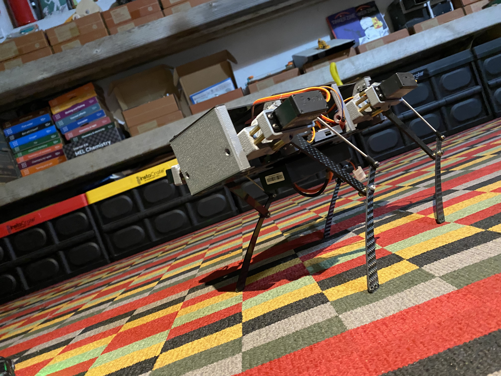

# pupper

## Overview

This repository hosts the code for Stanford Pupper and Stanford Woofer, Raspberry Pi-based quadruped robots that can trot, walk, and jump. 

Video of pupper in action: 

main project page: https://stanfordstudentrobotics.org/pupper

Instructions by creators: https://pupper.readthedocs.io/en/latest/

## How it works
https://github.com/stanfordroboticsclub/StanfordQuadruped

## How to Build Pupper
Main documentation: https://pupper.readthedocs.io/en/latest/
This site has all instructions and materials needed.

## Help
https://github.com/stanfordroboticsclub/StanfordQuadruped
