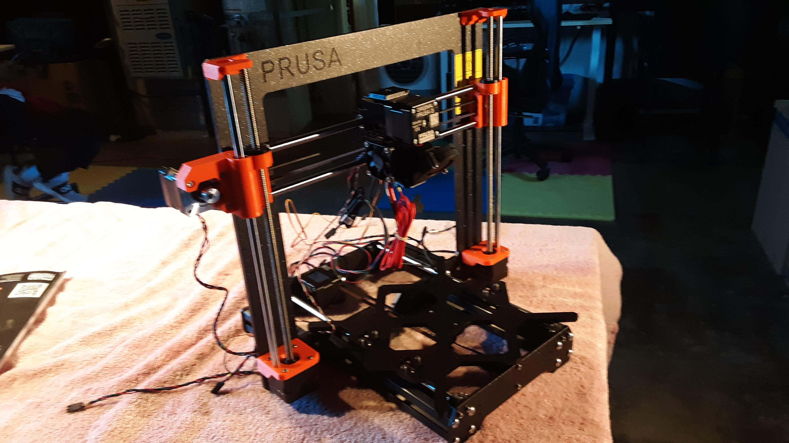

# Pupper

## Overview - An Inexpensive & Open-source Quadruped Robot

Stanford Pupper is an quadruped robot designed to help K-12 and undergraduate students get involved in exciting robotics research. 

This repository hosts the code for Stanford Pupper and Stanford Woofer, Raspberry Pi-based quadruped robots that can trot, walk, and jump. 

## Tech Specs

Cost: $600-$1000 if you source the parts yourself, otherwise cheaper if you purchase a parts kit. 

Build time: ~ 8 hours depending on expertise

Actuators: 12 x JX Servo CLS6336HV

## Video of pupper in action

## How it works
https://stanfordstudentrobotics.org/pupper

## How to Build Pupper
Main documentation: https://pupper.readthedocs.io/en/latest/
This site has all instructions and materials needed.

## Contributors
- [Zohran](https://github.com/zamoin)
- [Izaan](https://github.com/izaan)

## Help
https://github.com/stanfordroboticsclub/StanfordQuadruped

## Summer - 2021
2021 Summer Internship - 06/12 - 08/16
- [Pictures](https://photos.app.goo.gl/KWqq1wEC8hfWhWNT8)
- [YouTube Channel](https://www.youtube.com/playlist?list=PL6_LGlA3QhULBplfvBtZeD1Q1zcZa0OD2)

  
&nbsp; &nbsp; &nbsp; &nbsp;
  

  
&nbsp; &nbsp; &nbsp; &nbsp;
  

  
&nbsp; &nbsp; &nbsp; &nbsp;
  

  
&nbsp; &nbsp; &nbsp; &nbsp;
  

